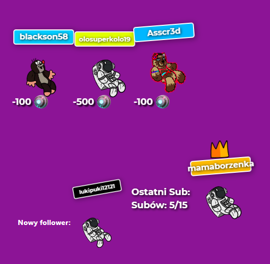

# KrissDrawing stream overlay - server

> Custom overlay and chat bot for [my twitch stream](https://www.twitch.tv/krissdrawing)

## Table of contents

- [General info](#general-info)
- [Screenshots](#screenshots)
- [Technologies](#technologies)
- [Features](#features)
- [Contact](#contact)

## General info

App handles channel points redeem, last subscriptions, new followers, and chat bot. I created it to expand customisation of displaying twitch events.

## Screenshots

## Technologies

- node - version 14.14
- apollo-server-express - version 2.18
- express - version 4.17
- graphql - version 15.3
- firebase-admin - version 9.2.0
- twitch (package) - version 4.4
- yeelight-node - version 1.1

## Features

- Twitch auth and token refreshing.
- Publishing points redeem information, and follow event.
- Storing last 3 point redeems in firebase, last follower, and sum of points spent for every user.
- Twitch chat bot commands, and timers.
- Displaing formated RocketLeague rank from API on chat.
- Yeelight RGB controlls from twitch chat.

To-do list:

- Store last followers to preserve refollowing event trigger.

## Contact

Created by [KrissDrawing](https://krissdrawing.pl/) - feel free to contact me!
